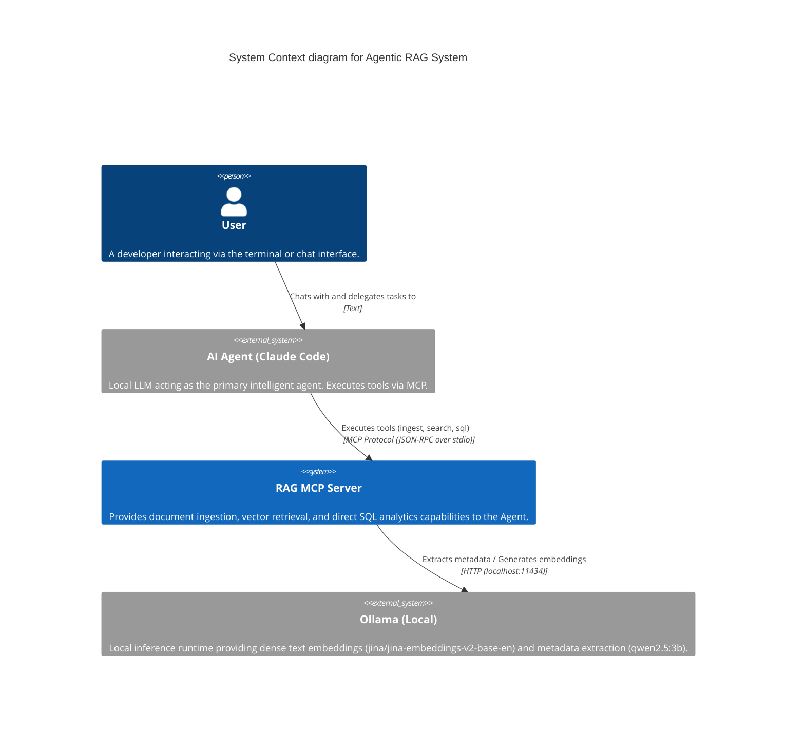
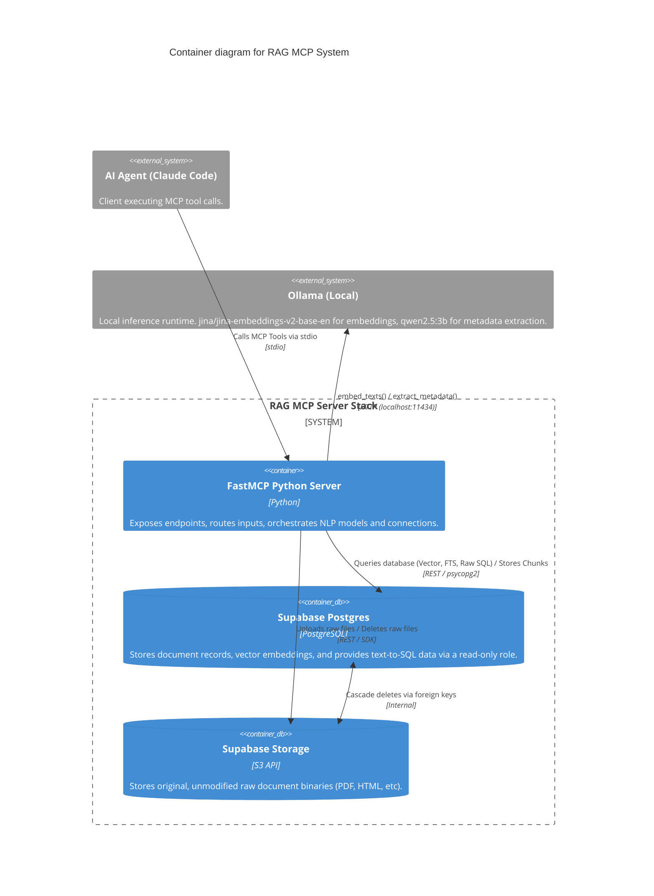
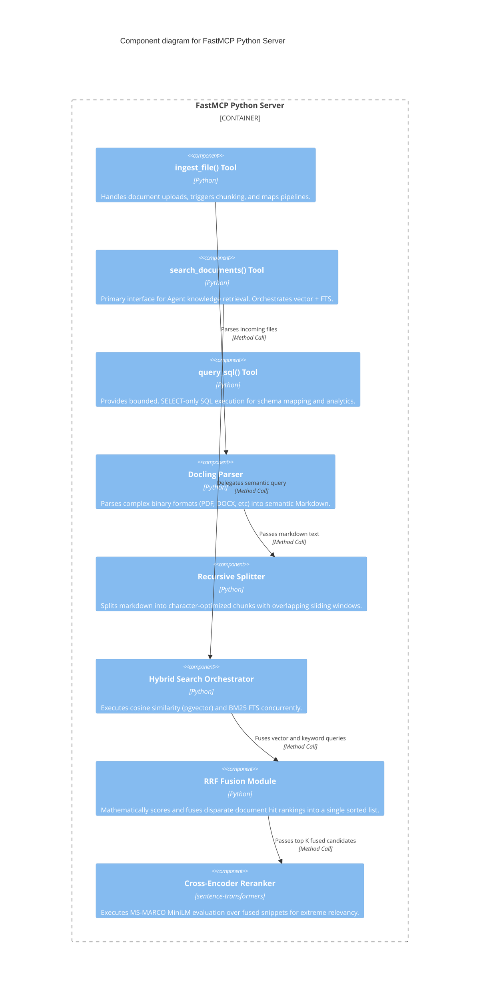
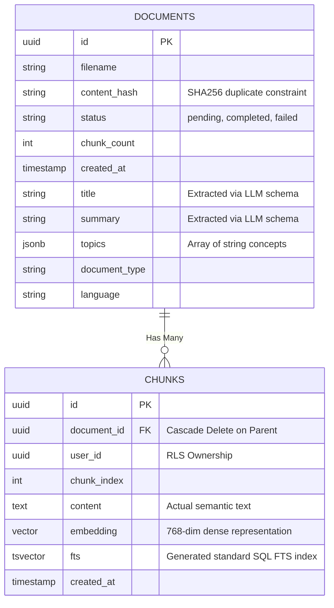

# System Architecture

The Agentic RAG system is built around the **Model Context Protocol (MCP)**, functioning as an external tool server that gives autonomous AI agents (like Claude Code) semantic search and context retrieval capabilities.

Below are the architectural C4 Model diagrams mapping the relationships of the system.

## Level 1: System Context Diagram

This diagram shows the high-level relationship between the AI Agent, the RAG MCP Server, and external dependencies.

## Level 2: Container Diagram

This diagram dives deeper into the internal containers that make up the RAG MCP Server. We utilize a Python backend for logic and a local Supabase stack for data persistence.

## Level 3: Component Diagram (FastMCP Server)

This diagram breaks down the internal responsibilities inside the Python `FastMCP` container application.

## Database Schema Model (Postgres)

This is a simplified entity-relationship visualization of the local Supabase stack.

