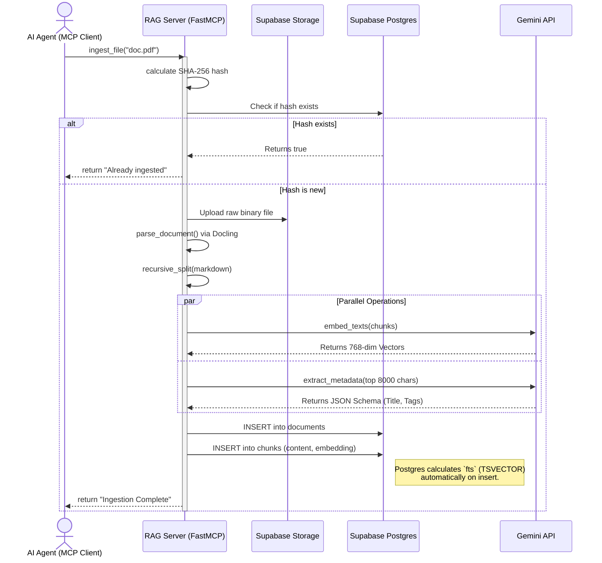
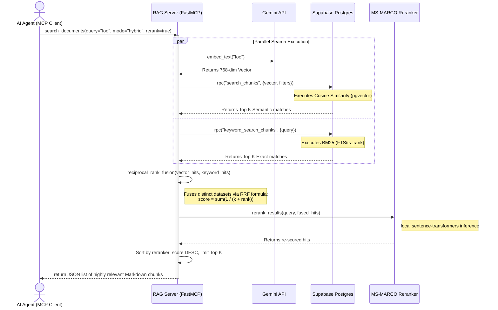

# Sequence Diagrams

These sequence diagrams map the specific operational execution flows of the Agentic RAG system.

## Sequence Diagram: Ingestion Process

This diagram illustrates the flow of data when an AI agent requests to ingest a document into the RAG system.

## Sequence Diagram: Retrieval (Read) Process

This diagram illustrates the dynamic hybrid search + reranking flow when the AI agent queries the system for knowledge.

